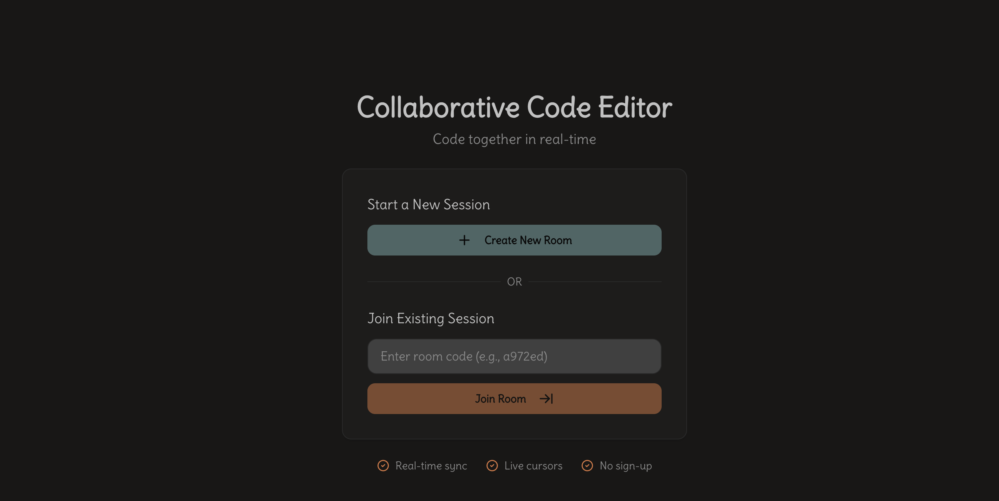

# Collaborative Code Editor
<div align="center">


</div>



Real-time collaborative code editor with WebSocket synchronization, live cursor tracking, and Mocked autocomplete. Built for pair programming and team collaboration.

## Features

- **Real-time Collaboration** - Multiple users edit simultaneously with instant sync
- **Live Cursor Tracking** - See where teammates are editing in real-time
- **Smart Autocomplete** - Context-aware code suggestions (Python)
- **No Sign-up Required** - Create a room and start coding immediately
- **WebSocket-based** - Sub-50ms latency for seamless collaboration
- **Redis Pub/Sub** - Horizontally scalable architecture

## Overview Architecture


### Tech Stack

**Frontend**
- Next.js 15 (React 19, TypeScript)
- Monaco Editor (VS Code's editor)
- shadcn/ui + Tailwind CSS
- WebSocket client

**Backend**
- FastAPI (Python 3.12)
- Redis (state + pub/sub)
- WebSocket server
- uv (package manager)

**Infrastructure**
- Docker + Docker Compose
- Multi-stage builds
- Health checks

## Quick Start

### Prerequisites
- Docker & Docker Compose
- Or: Node.js 22+, Python 3.12+, Redis

### Using Docker (Easier)

```bash
# Clone repository
git clone https://github.com/grimmy-dev/coed.git
cd coed

# Start all services
docker-compose up --build -d

# Access application
# Frontend: http://localhost:3000
# Backend:  http://localhost:8000
# Redis:    localhost:6379
```

### Manual Setup

**Backend:**
```bash
cd backend
uv install -r pyproject.toml
uv run main.py
```

**Frontend:**
```bash
cd frontend
pnpm install
pnpm dev
```

**Redis:**
```bash
docker run -d -p 6379:6379 redis:7-alpine
```

## Usage

1. **Create Room** - Click "Create New Room" to generate a unique room ID
2. **Share Link** - Copy and share the room URL with teammates
3. **Join Room** - Others enter the room code to join
4. **Code Together** - Edit code simultaneously with live sync
5. **See Cursors** - View teammates' cursor positions in real-time
6. **Use Autocomplete** - Pause typing for 600ms to trigger suggestions

## Project Structure

```
.
├── backend/              # FastAPI server
│   ├── config/          # Settings & Redis
│   ├── core/            # Connection manager
│   ├── models/          # Pydantic schemas
│   ├── routers/         # API endpoints
│   ├── services/        # Business logic
│   ├── BACKEND.md       # Backend docs
│   └── Dockerfile
├── frontend/            # Next.js app
│   ├── app/            # Pages
│   ├── components/     # React components
│   ├── hooks/          # Custom hooks
│   ├── lib/            # Utilities
│   ├── types/          # TypeScript types
│   ├── FRONTEND.md     # Frontend docs
│   ├── Dockerfile
│   └── next.config.ts
├── docker-compose.yml   # Orchestration
├── pyproject.toml
└── README.md           # This file
```

## API Endpoints

### REST
- `POST /rooms` - Create new room
- `GET /rooms/{room_id}/exists` - Check if room exists
- `POST /rooms/autocomplete` - Get code suggestions
- `GET /health` - Health check

### WebSocket
- `WS /ws/{room_id}` - Real-time collaboration

**Messages:**
- `init` - Initial room state
- `code_update` - Code changes
- `cursor_move` - Cursor positions
- `user_joined` - User connected
- `user_left` - User disconnected

## Environment Variables

**Project (.env):**
```bash
REDIS_URL=redis://localhost:6379
CORS_ORIGINS="http://localhost:3000"
BASE_URL=http://localhost:3000
ROOM_TTL_SECONDS=7200
NEXT_PUBLIC_URL=http://localhost:3000
NEXT_PUBLIC_API_URL=http://localhost:8000
NEXT_PUBLIC_WS_URL=ws://localhost:8000
```

## Key Features Explained

### Real-time Synchronization
- Debounced code updates (300ms) reduce network traffic
- Throttled cursor updates (100ms) prevent spam
- WebSocket reconnection with exponential backoff
- Last-write-wins conflict resolution

### Live Cursor Tracking
- Uses Monaco editor's actual measurements
- Adapts to font size and zoom level changes
- Color-coded cursors per user (shadcn palette)
- Smooth CSS transitions for cursor movement

### Autocomplete System
- Rule-based pattern matching (no ML required)
- Triggers: `def`, `class`, `for`, `import`, `try`, etc.
- 600ms debounce prevents excessive API calls
- Context-aware suggestions based on cursor position

### Scalability
- Redis Pub/Sub enables horizontal scaling
- Multiple backend instances share state
- Stateless WebSocket connections
- Room data auto-expires (2-hour TTL)

## Performance

- **Code Sync Latency:** < 50ms (local), < 200ms (cloud)
- **Cursor Updates:** 10 updates/second max (throttled)
- **Autocomplete:** < 100ms response time
- **Room Creation:** < 10ms
- **WebSocket Connection:** < 500ms

## Known Limitations

1. **No Persistence** - Code is lost when all users leave (in-memory only)
2. **Last-Write-Wins** - Simple conflict resolution, no CRDT
3. **Python Only** - Autocomplete limited to Python (easily extensible)
4. **Single Room** - Users can only be in one room at a time

## Troubleshooting

### WebSocket Connection Failed
```bash
# Check backend is running
curl http://localhost:8000/health

# Check Redis is running
redis-cli ping

# Check CORS configuration
# Ensure NEXT_PUBLIC_WS_URL matches backend
```

### Room Not Found
```bash
# Rooms expire after 2 hours (ROOM_TTL_SECONDS)
# Create a new room if expired
```

### Autocomplete Not Working
```bash
# Check backend logs for errors
docker-compose logs backend

# Verify endpoint
curl -X POST http://localhost:8000/rooms/autocomplete \
  -H "Content-Type: application/json" \
  -d '{"code": "def ", "cursor_position": 4, "language": "python"}'
```

## Development

### Docker Commands
```bash
# Build images
docker-compose build

# View logs
docker-compose logs -f

# Restart service
docker-compose restart backend

# Clean up
docker-compose down -v
```

## Contributing

This is an interview project demonstrating:
- Real-time collaborative systems
- WebSocket implementation
- Clean architecture principles
- Production-ready Docker setup

## Acknowledgments

- Monaco Editor by Microsoft
- FastAPI by Sebastián Ramírez
- shadcn/ui by shadcn
- Redis by Redis Ltd.

---

## Demo Screenchot


---
**Built with using Next.js, FastAPI, Redis, and WebSockets**

For detailed documentation, see:
- [Backend Documentation](./backend/BACKEND.md)
- [Frontend Documentation](./src/FRONTEND.md)